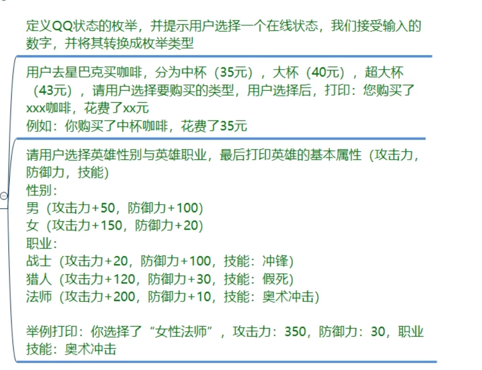
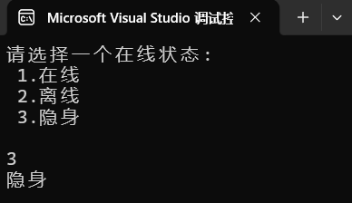
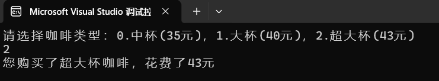
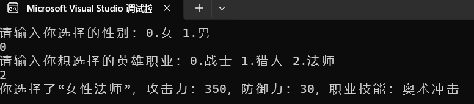
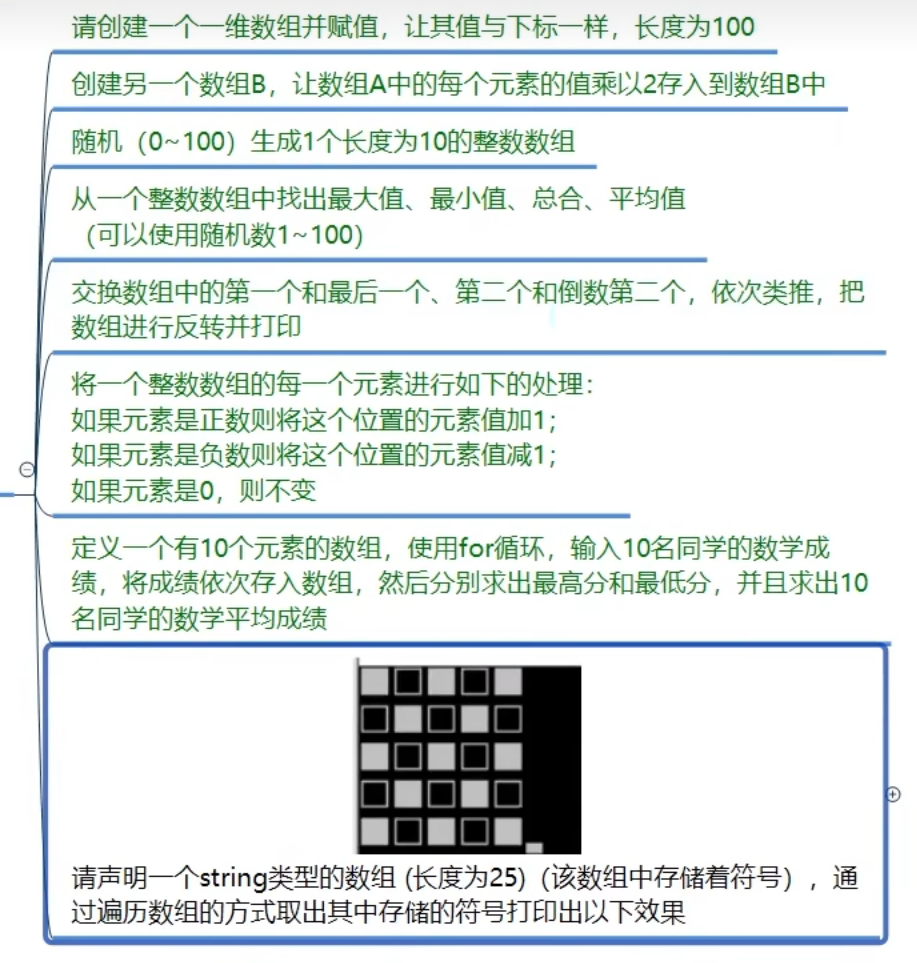
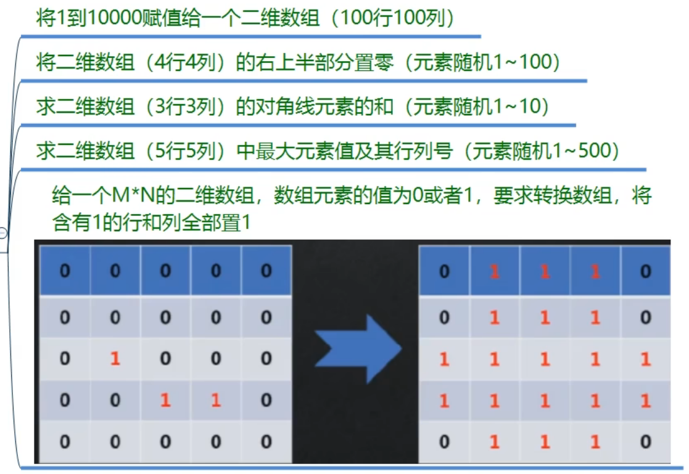
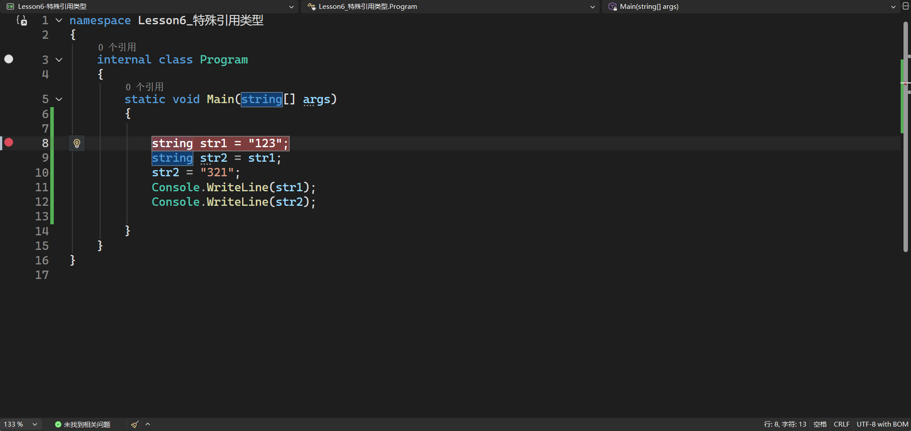
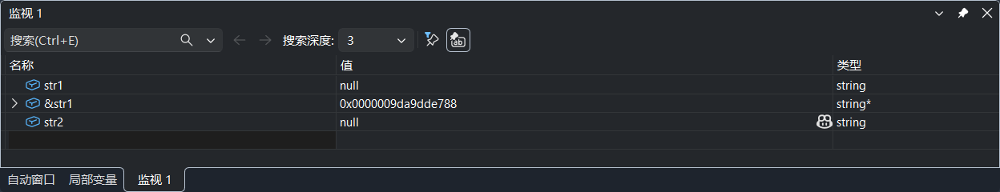

# struct结构体与switch条件语句

**贯穿**：在switch语句中，两个条件的执行语句相同时，可以将上面一个条件语句的执行语句与`break`删除，此时他们会被**贯穿**，即两个条件都执行相同的行为。

```c#
            E_MonsterType monsterType = E_MonsterType.Boss;
            switch (monsterType)
            {
                case E_MonsterType.Normal:
                    
                case E_MonsterType.Boss:
                    Console.WriteLine("Boss逻辑"); //此时都执行Boss逻辑
                    break;
                default:
                    break;
            }
```


笔记

```c#
namespace Lession1_枚举
{

    #region 知识点一 基本概念

    #region 1.枚举是什么
    //枚举是一个比较特别的存在
    //它是一个被命名的整型常量的集合
    //一般用它来表示 状态 类型 等等
    #endregion

    #region 2.申明枚举 和 申明枚举常量
    //注意：申明枚举 和 申明枚举常量 是两个概念
    //申明枚举:  相当于是 创建一个自定义的枚举类型
    //申明枚举变量： 使用申明的自定义枚举类型 创建一个枚举变量
    #endregion

    #region 3.声明枚举语法
    // 枚举名以E或者E_开头 作为命名规范
    //enum E_自定义枚举名
    //{
    //    自定义枚举名字, //枚举中包裹的 整形常量 第一个默认值是0 下面会依次累加
    //    自定义枚举名字1,//1
    //    自定义枚举名字2,//2
    //}

    //enum E_自定义枚举名
    //{
    //    自定义枚举名字 = 5, //默认值为5
    //    自定义枚举名字1, //6
    //    自定义枚举名字2 = 100, 
    //    自定义枚举名字3, //101
    //    自定义枚举名字4, //102
    //}

    #endregion

    #endregion

    #region 知识点二 在哪申明枚举
    //1.namespace语句块中 (常用)
    //2.class语句块中 struct语句块中
    //注意:枚举不能在函数语句块中申明！！

    enum E_MonsterType
    { 
        Normal,//0

        Boss,//1
    }

    enum E_PlayerType
    { 
        Main,
        Other,
    }


    #endregion


    internal class Program
    {
        static void Main(string[] args)
        {
            Console.WriteLine("枚举");
            #region 知识点三 枚举的使用
            //申明枚举变量
            //自定义的枚举类型 变量名 = 默认值了;(自定义的枚举类型.枚举项)
            E_PlayerType playerType = E_PlayerType.Main;

            if (playerType == E_PlayerType.Main)
            {
                Console.WriteLine("主玩家逻辑");
            }
            else if (playerType == E_PlayerType.Other)
            {
                Console.WriteLine("其他玩家逻辑");
            }

            //枚举和switch 是天生一对
            E_MonsterType monsterType = E_MonsterType.Boss;
            switch (monsterType)
            {
                case E_MonsterType.Normal:
                    Console.WriteLine("普通怪物逻辑");
                    break;
                case E_MonsterType.Boss:
                    Console.WriteLine("Boss逻辑");
                    break;
                default:
                    break;
            }

            #endregion


            #region 知识点四 枚举的类型转换
            //1.枚举和int互转
            int i = (int)playerType;
            Console.WriteLine(i);
            //int 转枚举
            playerType = 0;

            //2.枚举和string相互转换
            string str = playerType.ToString();
            Console.WriteLine(str);

            //把string转换成枚举
            //Parse后 第一个参数：你要转为的是哪个 枚举类型第二个参数：用于转换的对应枚举项的字符串
            //转换完毕后是一个通用的类型我们需要用括号强转成我们想要的目标枚举类型
            playerType = (E_PlayerType)Enum.Parse(typeof(E_PlayerType), "Other");
            Console.WriteLine(playerType);
            #endregion


            #region 知识点五 枚举的作用
            //在游戏开发中，对象很多时候会有许多的状态
            //比如玩家 有一个动作状态我们需要用一个变量或者标识 来表示当前玩家处于的是哪种状态
            //综合考虑 可能会使用 int 来表示他的状态
            // 1 行走 2 待机 3 跑步 4跳跃。。。。。。。等等
            //枚举可以帮助我们 清晰的分清楚状态的含义
            #endregion


        }
    }
}

```


## 练习题目




### 第一题

```
定义QQ状态的枚举，并提示用户选择一个在线状态，我们接受输入的数字，并将其转换成枚举类型
```

首先在`namespace`下定义状态枚举`enum Status`,  接着写提示用户选择在线状态，再来接收数字。

```c#
namespace question_1
{
    enum E_status
    { 
        在线 = 1,
        离线,
        隐身,
    }

    internal class Program
    {
        static void Main(string[] args)
        {
            E_status status;
            Console.WriteLine("请选择一个在线状态:\n 1.在线\n 2.离线\n 3.隐身\n");
            int i = int.Parse(Console.ReadLine());
            status = (E_status)i; 
            Console.WriteLine(status);
        }
    }
}

```



### 第二题

```
用户去星巴克买咖啡，分为中杯(35元)，大杯(40元)，超大杯
(43元)，请用户选择要购买的类型，用户选择后，打印：您购买了
xxx咖啡，花费了xx元
例如：你购买了中杯咖啡，花费了35元
```

首先定义咖啡类型，再让用户选择，接着用Switch语句来判断即可

```c#
namespace question_1
{
    enum E_Cup
    { 
        中杯,
        大杯,
        超大杯,
    }

    internal class Program
    {
        static void Main(string[] args)
        {
            E_Cup cup;
            Console.WriteLine("请选择咖啡类型：0.中杯(35元)，1.大杯(40元)，2.超大杯(43元)");
            try
            {
                int i = int.Parse(Console.ReadLine());
                cup = (E_Cup)i;
                switch (cup)
                {
                    case E_Cup.中杯:
                        Console.WriteLine("您购买了" + cup + "咖啡，花费了35元");
                        break;
                    case E_Cup.大杯:
                        Console.WriteLine("您购买了" + cup + "咖啡，花费了40元");
                        break;
                    case E_Cup.超大杯:
                        Console.WriteLine("您购买了" + cup + "咖啡，花费了43元");
                        break;
                    default:
                        break;
                }

            }
            catch (Exception)
            {

                Console.WriteLine("请输入数字");
            }

        }
    }
}

```



### 第三题

```
请用户选择英雄性别与英雄职业，最后打印英雄的基本属性(攻击力，防御力，技能)
性别:
男(攻击力+50，防御力+100)
女(攻击力+150，防御力+20)
职业:
战士(攻击力+20，防御力+100，技能：冲锋)
猎人(攻击力+120，防御力+30，技能：假死)
法师(攻击力+200，防御力+10，技能：奥术冲击)
举例打印：你选择了“女性法师”，攻击力：350，防御力：30，职业技能：奥术冲击
```

先在namespace写好职业的枚举，性别通过if语句来判断就行，用两个变量来分别记录攻击力和防御力

```c#
namespace question_1
{
    enum E_Hero
    { 
        战士,
        猎人,
        法师
    }

    internal class Program
    {
        static void Main(string[] args)
        {
            int power = 0,defance = 0;
            E_Hero hero;
            Console.WriteLine("请输入你选择的性别：0.女 1.男");
            try
            {
                int x = int.Parse(Console.ReadLine());
                Console.WriteLine("请输入你想选择的英雄职业：0.战士 1.猎人 2.法师");
                int i = int.Parse(Console.ReadLine());
                hero = (E_Hero)i;
                if (x == 0)
                {
                    power += 150;
                    defance += 20;
                    switch (hero)
                    {
                        case E_Hero.战士:
                            power += 20;
                            defance += 100;
                            Console.WriteLine("你选择了“女性"+hero+"”，攻击力："+power+"，防御力："+defance+"，职业技能：冲锋");
                            break;
                        case E_Hero.猎人:
                            power += 120;
                            defance += 30;
                            Console.WriteLine("你选择了“女性" + hero + "”，攻击力：" + power + "，防御力：" + defance + "，职业技能：假死");
                            break;
                        case E_Hero.法师:
                            power += 200;
                            defance += 10;
                            Console.WriteLine("你选择了“女性" + hero + "”，攻击力：" + power + "，防御力：" + defance + "，职业技能：奥术冲击");
                            break; 
                        default:
                            break;
                    }
                }
                else 
                {
                    power += 50;
                    defance += 100;
                    switch (hero)
                    {
                        case E_Hero.战士:
                            power += 20;
                            defance += 100;
                            Console.WriteLine("你选择了“男性" + hero + "”，攻击力：" + power + "，防御力：" + defance + "，职业技能：冲锋");
                            break;
                        case E_Hero.猎人:
                            power += 120;
                            defance += 30;
                            Console.WriteLine("你选择了“男性" + hero + "”，攻击力：" + power + "，防御力：" + defance + "，职业技能：假死");
                            break;
                        case E_Hero.法师:
                            power += 200;
                            defance += 10;
                            Console.WriteLine("你选择了“男性" + hero + "”，攻击力：" + power + "，防御力：" + defance + "，职业技能：奥术冲击");
                            break;
                        default:
                            break;
                    }
                }
            }
            catch (Exception)
            {

                Console.WriteLine("请输入数字");
            }
        }
    }
}

```



# 数组

总结
1.概念：同一变量类型的数据集合
2.一定要掌握的知识：申明，遍历，增删查改
3.所有的变量类型都可以申明为数组
4.她是用来批量存储游戏中的同一类型对象的 容器比如 所有的怪物 所有的玩家

```C#
namespace lesson2_数组学习
{
    internal class Program
    {
        static void Main(string[] args)
        {
            Console.WriteLine("一维数组");

            #region 知识点一 基本概念
            //数组是存储一组相同类型的集合
            //数组分为 一维、多维、交错数组
            //一般情况 一维数组 就简称为 数组
            #endregion

            # region 知识点二 数组的申明
            // 变量类型[]数组名;//只是申明了一个数组但是并没有开房
            // 变量类型 可以是我们学过的 或者没学过的所有变量类型
            int[] arr1;

            //变量类型[] 数组名 = new 变量类型[数组的长度];
            int[] arr2 = new int[5];
            //这种方式 相当于开了5个房间 但是房间里面的int值默认为0
            // 变量类型[]数组名 = new 变量类型[数组的长度]{内容1,内容2,内容3,.......};
            int[] arr3 = new int[5] { 1, 2, 3, 4, 5 };
            // 变量类型[] 数组名 = new 变量类型[]{内容1,内容2,内容3,.......};
            int[] arr4 = new int[] {1,2,3,4,5,6,7,8,9}; //后面的内容就决定了数组的长度“房间数”
            
            // 变量类型[] 数组名 = {内容1,内容2,内容3,......};
            int[] arr5 ={1,3,4,5,6}; 
            //后面的内容就决定了数组的长度“房间数”

            bool[] arr6 = { true, false };
            #endregion

            #region 知识点三 数组的使用
            int[] array = { 1,2,3,5,6};

            //1.获取数组的长度
            //数组变量名.Length
            Console.WriteLine(arr5.Length);
            //获取数组中的元素
            //数组中的下标和索引从零开始i
            //通过 索引下标去 获得数组中的某一个元素的值时
            //一定注意不能越界 下标范围 0~length-1

            //增加数组元素
            //数组初始化以后 是不能够 直接添加新的元素的
            int[] array2 = new int[6];
            for (int i = 0; i < array.Length; i++)
            {
                array2[i] = array[i];
            }
            array = array2;

            //删除数组的元素
            //数组初始化后 是不能够 直接删除元素的
            //同上用搬家的原理
            int[] array3 = new int[5];
            for (int i = 0;i < array3.Length; i++)
            {
                array3[i] = array[i];
            }
            array = array3;
            Console.WriteLine(array.Length);
            #endregion


        }
    }
}

```

## 练习题目



# 二维数组

## 知识点一 基本概念

**二维数组**是使用两个下标(索引)来确定元素的数组

两个下标可以理解成 **行标** 和 **列标**

比如矩阵

| 行\列 | 0       | 1       | 2       |
| ----- | ------- | ------- | ------- |
| 0     | 1 [0,0] | 2 [0,1] | 3 [0,2] |
| 1     | 4 [1,0] | 5 [1,1] | 6 [1,2] |
|       |         |         |         |

可以用二维数组 int[2,3]表示

好比 两行 三列的数据集合

### 内存中的二维数组存储

虽然看到的是二维，但在内存中其实是连续的一维空间

```
地址增加方向 →

+----+----+----+----+----+----+----+----+----+
| 1  | 2  | 3  | 4  | 5  | 6  | 7  | 8  | 9  |
+----+----+----+----+----+----+----+----+----+
 ↑第一行      ↑第二行      ↑第三行
```

所以遍历时，**先行后列**的方式最快，因为他符合数组在内存中的存储方式


## 知识点二 二维数组的申明


申明: 

```c#
变量类型[,] 二维数组变量名;
int[,] arr; //声明过后 会在后面进行初始化

变量类型[,] 二维数组变量名 = new 变量行[行,列];
int[,] arr2 = new int[3,3]； //没有初始化，内容默认为0

变量类型[,] 二维数组变量名 = new 变量类型[行,列]{ {0行内容1，0行内容2，0行内容3.......}，{1行内容1，1行内容2，1行内容3.......}.... };
int[,] arr3 = new int[3, 3] { { 1, 2, 3 }, { 4, 5, 6 }, { 7, 8, 9 } };

变量类型[,] 二维数组变量名 = new 变量类型[,]{ {0行内容1，0行内容2，0行内容3.......}，{1行内容1，1行内容2，1行内容3.......}.... };
int[,] arr3 = new int[, ] { { 1, 2, 3 }, { 4, 5, 6 }, { 7, 8, 9 } };

变量类型[,] 二维数组变量名 = { {0行内容1，0行内容2，0行内容3.......}，{1行内容1，1行内容2，1行内容3.......}.... };
int[,] arr3 = { { 1, 2, 3 }, { 4, 5, 6 }, { 7, 8, 9 } };
  
```

## 知识点三 二维数组的使用

1. 二维数组的长度

   我们要获取行和列分别是多少

   ```c#
   int[,] array = new int[,] {{1,2,3},{4,5,6}};
   //得到多少行
   Console.WriteLine(array.GetLength(0));
   //得到多少列
   Console.WriteLine(array.GetLength(0));
   ```

   

2. 获取二维数组中的元素

   ​	**注意：**第一个元素的索引是0 最后一个元素的索引是 长度-1

   

3. 修改二维数组中的元素

   ```c#
   array[0,0] = 99;
   Console.WriteLine(array[0,0]);
   //输出99
   ```

   

4. 遍历二维数组

   ```c#
    int[,] array = { { 1, 2, 3 }, { 4, 5, 6 }};
    for (int i = 0; i < array.GetLength(0); i++)
    {
   	for (int j = 0; j < array.GetLength(1); j++)
       {
       //i 行 0 1
       //j 列 0 1 2
       Console.WriteLine(array[i, j]);
       //0,0  0,1  0,2
       //1,0  1,1  1,2
       }
    }
   ```

   

5. 增加数组的元素

   ​	基本等同于一维数组的处理，只是这里需要用到上面的两次遍历

6. 删除数组的元素

   ​	同上相反的方法

7. 查找数组中的元素

   通过遍历和条件语句寻找

总结：

- 概念：同一变量类型的 行列数据集合
- 一定要掌握的内容：申明，遍历，增删查改
- 所有的变量类型都可以申明为 二维数组
- 游戏中一般用来存储 矩阵，在控制台小游戏中可以用二维数组 来表示地图格子

## 练习题目



# 交错数组

## 知识点一 基本概念

交错数组是 **数组的数组** ，每个维度的数量可以不同

**注意：**二维数组的每行的列数相同，交错数组的每行的列数可能不同


## 知识点二 数组的声明

```C#
//变量类型[][]交错数组名;
int[][] arr1;

//变量类型[][] 交错数组名 = new变量类型[行数][];
int[][] arr2 = new int[3][];

//变量类型[][] 交错数组名 = new 变量类型[行数][]{ —维数组1，—维数组2,..…... };
int[][] arr3 = new int[3][] {  new int[] { 1, 2, 3 },
							new int[] { 1, 2 },
                               new int[] { 1 }};

//变量类型[][] 交错数组名 = new 变量类型[][]{ —维数组1，—维数组2,..…... };
int[][] arr3 = new int[][] {  new int[] { 1, 2, 3 },
							new int[] { 1, 2 },
                               new int[] { 1 }};

//变量类型[][] 交错数组名 = { —维数组1，—维数组2,..…... };
int[][] arr3 = {  new int[] { 1, 2, 3 },
				new int[] { 1, 2 },
                 new int[] { 1 }};
```

## 知识点三 数组的使用

交错数组一般在每行列数不一样或的情况下使用

**分别得到行和列的长度**

```c#
//行
Console.WriteLine(array.GetLength(0));
//得到第0行的列数
Console.WriteLine(array[0].Length);
```

**获取交错数组中的元素**

```c#
Console.WriteLine(array[0][1]);
```

**修改交错数组中的元素**

```c#
array[0][1] = 99;
Console.WriteLine(array[0][1]);
//输出99
```

遍历

```c#
for(int i = 0;i < array.GetLength(0); i++)
{
    for(int j = 0; j < array[i].Length; j++)
    {
     	Console.Write(array[i][j] + " ");   
	}
    Console.WriteLine();
}
```

# 值和引用类型

复杂数据类型：

enum 枚举

数组 (一维，二维，交错)

引用类型：string，数组，类

值类型：其他、结构体

## 值类型和引用类型的区别

1.使用上的区别

值类型 在相互赋值时，把**内容拷贝**给了对方， 如果后面对方发生改变，我也不会进行改变

引用类型的相互赋值是让两者指向同一个值，如果后续其中一个发生改变，那么就都会变

2.为什么会有这些区别

值类型和应用类型**存储在的内存区域是不同的**，他们的存储方式不同

所以造成了 他们在使用上的区别

值类型存储在 栈空间 --> 系统分配，自动回收，小而快

引用类型 存储在 堆空间 -->手动申请和释放，大而慢

引用类型的变量在栈中保存堆对象的内存地址，对象真实数据存放在堆中。若两个引用变量用地址对比相等，说明二者存储的地址一致，指向同一个堆对象。此时修改堆中对象内部的数据，两个变量保存的地址不会发生变化，二者读取到的数据会同步更新，始终保持一致。

而值类型赋值时会完整复制一份独立数据副本，新旧数据完全隔离，修改其中一份不会影响另一份。

## 特殊引用类型string

String的它变我不变

由于string的特殊性，string并非像其他引用类型是他变我也变，而是他变我不变

原因是他具备值类型的特征，在给string类型变量重新赋值时，会在堆中给他重新分配空间。

所以说当我们频繁的改变string，重新赋值的时候，会**产生内存垃圾**

## 拓展：通过断点调试 在监视窗口中查看 内存信息

首先给对应的代码打上断点（左键代码最左侧那一栏）



接着运行代码会看到左下角的监视窗口

我们可以右键，点击添加监视，然后输入对应变量，输入`&str1`可以查看它在断点时的具体地址




# 函数


## 函数基本语法

```C#
  1      2       3              4
static 返回类型 函数名(参数类型 参数名1, 参数类型 参数名2,...............)
{
	//函数内容
      
      return 返回值;(如果有返回类型才返回)
}
```

返回类型可以写**任意的变量类型** 14种变量类型 + 复杂数据类型(数组、枚举、结构体、类class)

## ref和out

当我们设置一个函数，在内部写好改变传参的值的代码后再调用它对外部的变量进行赋值，是无法成功赋值的。

```C#
static void ChangeValue(int value)
{
    value = 3;
}

static void Main(string[] args)
{
    int a = 1;
    ChangeValue(a);
	Console.WriteLine(a);
}
//输出 1
```

而ref和out的作用就是可以解决在函数内部改变外部传入的内容->**里面变了，外面也变**

当我们向函数传递参数时，例如 `(int value)` 中的 `value`，函数并不会直接使用外部的变量，而是会创建一个新的参数变量（可以理解为新开了一个房间），并把我们传入变量中的值复制一份放进去。因此，在函数内部对 `value` 进行赋值操作时，只会修改这个新的参数变量，不会影响外部原来的变量。

但如果这里是传入**引用类型**的参数，又会不一样，因为他们传入的是对应堆存储的地址，堆中的值变了，外部原变量也相应进行改变。

**ref的使用**

在函数的参数前写上ref 注意，在调用时也要在参数前加上ref关键字

```c#
static void ChangeValue(ref int value)
{
    value = 3;
}

static void Main(string[] args)
{
    int a = 1;
    ChangeValue(ref a);
	Console.WriteLine(a);
}
//输出 3
```

**out的使用同上**

**ref和out的区别**

1. ref传入的变量必须初始化，而out不用
2. out传入的变量必须在内部赋值，而ref不用

总得来说，ref传入的变量必须初始化，但是在内部可改可不改，out传入的变量不用初始化，但是在内部必须修改该值（必须赋值）

## 变长参数和参数默认值

有时候我们会遇到需要传入不确定个参数的情况，比如需要计算n个整数的和。我们是不可能写n个传参的，所以这里就可以用到变长参数。

它的关键字是`params`

```c#
static int Sum(params int[] arr)
{
    int sum = 0;
    for (int i = 0; i < arr.Length; i++)
    {
        sum += arr[i];
    }
    return sum;
}
```

`params int[]`意味着可以传入n个int参数 n可以等于0 传入的参数会存在arr数组中

这里要注意的是，1，**params关键字后面必为数组** 2，数组的类型可以是任意的类型 3，函数参数可以有 别的参数和 params关键字修饰的参数

4，**函数参数中只能最多出现一个params关键字** 并且一定是最后一组参数 前面可以有n个其他参数

## 参数默认值

 有参数默认值的参数一般称为**可选参数**

它的作用是 当调用函数时可以不传入参数，不传就会使用默认值作为参数的值

```c#
static void Speak(string str = "我没什么话可说")
{
    Console.WriteLine(str);
}
Speak();
//输出 我没什么话可说
Speak("hhhh");
//输出 hhhh
```

注意： 

1.支持多参数默认值，每个参数都可以有默认值 。

2.如果要混用 可选参数 必须写在普通参数的后面


 # 结构体

## 基本概念

结构体是一种自定义变量类型，类似枚举，需要自己定义

它是数据和函数的集合

在结构体中，可以申明各种变量和方法

作用：用来表现存在关系的数据集合， 比如用结构体表现学生 动物 人类等

## 基本语法

结构体一般写在 namespace语句块中

结构体关键字`struct`

```c#
struct 自定义结构体命名
{
    //第一部分： 变量
    //第二部分： 构造函数
    //第三部分： 函数
}
```


## 实例

```c#
//表现学生数据的结构体
struct Student
{
    //变量 结构体申明的变量 不能直接初始化
    //变量类型可以写任意类型 但不能是自己的结构体 例：Student s;,这样会报错。
	int age;
    bool sex;
    int number;
    string name;
    
   	//构造函数
  	
    //函数方法
    //用来表示这个数据结构的行为
    
    //注意 在结构体中的方法 目前不需要加 static关键字
    void Speak()
    {
        Console.WriteLine("我的名字是{0},我今年{1}岁",name,age);
    }
    //可以根据需求,写无数个函数
}

```

## 结构体的使用

`变量类型 变量名;`

例

```
Student s1;
```

如果要调用结构体中的方法的话,必须要给他全部的变量都赋值才行.

## 访问修饰符

修饰机构体中变量和方法 是否能被外部使用

public 公共的 可以被外部访问 private 私有的 只能在内部使用

默认不写 为private

所以要在变量和函数前加上public才能够被外部访问

```c#
struct Student
{
    //变量 结构体申明的变量 不能直接初始化
    //变量类型可以写任意类型 但不能是自己的结构体 例：Student s;,这样会报错。
	public int age;
    public bool sex;
    public int number;
    public string name;
    
   	//构造函数
  	
    //函数方法
    //用来表示这个数据结构的行为
    
    //注意 在结构体中的方法 目前不需要加 static关键字
    public void Speak()
    {
        Console.WriteLine("我的名字是{0},我今年{1}岁",name,age);
    }
    //可以根据需求,写无数个函数
}

```


## 结构体的构造函数

1. 构造函数没有返回值
2. 它的函数名必须和结构体名相同
3. 必须有参数
4. 如果申明了构造函数,那么必须在其中对所有变量数据初始化

例

```c#
public Student(int age, bool sex, int number, string name)
{
	//新的关键字 this
	//代表自己,用这个将内部定义变量和传参进行区别
	this.age = age;
	this.sex = sex;
	this.number = number;
	this.name = name;
}

使用->Student s2 = new Student(18,true,2,"小红");
```

一般用构造函数 是为了方便初始化

注意:
1.在结构体中申明的变量不能初始化 只能在外部或者在函数中赋值(初始化)

2.在结构体中申明的函数不用加static.
