# 面向对象编程概念

**面向对象编程就是把程序中的事物看作一个个对象，每个对象都拥有自己的属性（数据）和行为（方法），对象之间通过相互协作完成程序功能。**

面向对象的四大核心机制

**封装（Encapsulation）**：隐藏内部实现，只暴露必要接口。

**继承（Inheritance）**：子类继承父类的属性和方法，实现代码复用。

**多态（Polymorphism）**：同一个接口，不同对象表现出不同的行为。

**抽象（Abstraction）**：提取事物的共同特征，忽略无关细节。

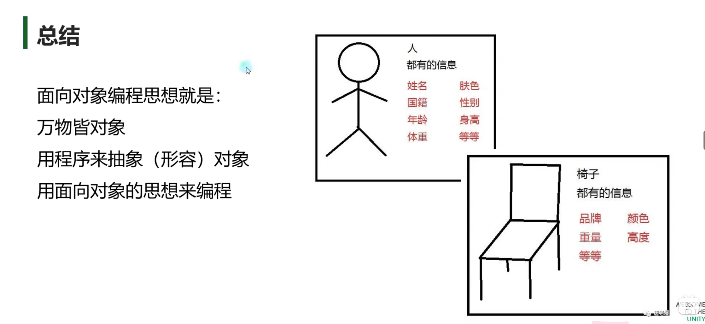


# 成员方法

## 基本概念

**成员方法用来表现对象行为**

1. 申明在类语句快中
2. 是用来描述对象的行为的
3. 规则和函数申明规则相同
4. 收到访问修饰符规则影响
5. 返回值不受限制
6. 方法数量不受限制

注意： 成员方法不要加`static`关键字 成员方法必须实例化出对象，再通过对象来使用 相当于该对象执行了某个行为

例：

```C#
class Person
{
	public string name;
	public int age;
    /// <summary>
    ///判断是否成年
    /// </summary>
    ///<returns></returns>

    public bool IsAdult()
    {
    	return age >= 18;
    }
    /// <summary>
    ///说话的行为
    /// </summary>
    /// <param name="str">说话的内容</param>
    public void Speak(string str)
    {
		Console.WriteLine("{0}说{1}", name, str);
    }
}
```

## 成员方法的使用

成员方法 **必须实例化出对象 再通过对象来使用**

```C#
Person p = ew Person();
p.name = "唐老狮";
p.age = 18;
p.Speakl("我爱你");

//输出：唐老狮说我爱你
```

## 练习题

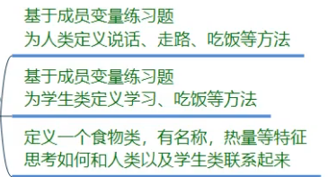


# 构造、析构、垃圾回收

## 析构函数

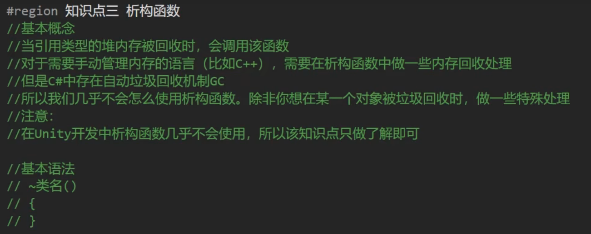

## 垃圾回收机制

垃圾回收，英文简写为**GC**(Garbage Collector)

- 垃圾回收的过程是在遍历堆(Heap)上动态分配的所有对象
- 通过识别它们是否被引用来确定哪些对象是垃圾，哪些对象仍要被使用
- 所谓的垃圾就是没有被任何变量，对象引用的内容
- 垃圾就需要被回收释放

垃圾回收有很多种算法，比如：

- 引用计数(Reference Counting)
- 标记清除(Mark Sweep)
- 标记整理(Mark Compact)
- 复制集合(Copy Collection)


GC只负责**堆(Heap)**内存的垃圾回收

引用类型都是存在**堆(Heap)**中的，所以他的分配和释放都通过垃圾回收机制来管理


**栈(Stack)**上的内存是由系统自动管理的
值类型在**栈(Stack)**中分配内存的，他们有自己的生命周期，不用对他们进行管理，会自动分配和释放


具体机制看视频

<iframe width="100%" height="468" src="//player.bilibili.com/player.html?bvid=BV1tV411q7Rq&p=8&autoplay=0" scrolling="no" border="0" frameborder="no" framespacing="0" allowfullscreen="true" &autoplay=0> </iframe>

 

# 成员属性

## 基本概念

1. 用户保护成员变量

2. 为成员属性的获取和赋值添加逻辑处理

3. 解决3P的局限性

   **3P** -> public --- 内外访问   private---内部访问   protected---内部和子类访问

属性可以让成员变量在外部

只能获取 不能修改 或者 只能修改 不能获取


 ## 基本语法

```C#
访问修饰符 属性类型 属性名
{
    get
    {
        return 返回值;
    }
    set
    {
    	赋值，逻辑代码。    
    }
}
```

例

```c#
class Person
{
	private string name;
	private int age;
	private int money;
	private bool sex;
	
	//属性的命名一般使用 帕斯卡命名法
	public string Name
	{
		get
		{
            //可以在返回之前添加一些逻辑规则
			//就是这个属性可以获取的内容
			return name;
		}
		set
		{
			//可以在设置之前添加一些逻辑规则
            // value 关键字 用于表示 外部传入的值
            name = value;
		}
	}
    
    public int Money
    {
        get
        {
            //解密处理
            return money;
        }
        set 
        {
            //可以进行加密处理 比如在这+5,然后在get返回-5的值
            money = value;
		}
	}
}
```

## 成员属性中 get和set前可以加访问修饰符

默认不加，会使用属性申明时的访问权限

加的访问修饰符要低于属性的访问权限

不能让get和set的访问权限都低于属性的权限


比如这样就是不行的，里面的访问权限不能比外部的高

```c#
private int Money
{
    get 
    {
        ...
    }
    public set
    {
        ...
	}
}
```

**注意是可以只写一个get或者set的**

## 自动属性

作用：外部能的不能改的特征

如果类中有一个特征是只希望外部能得不能改的 又没什么特殊处理的话

可以直接使用自动属性

例

```c#
public float Height
{
	get; 
    private set; //外部读，内部写
}//自动申明成员变量来保存数值
```


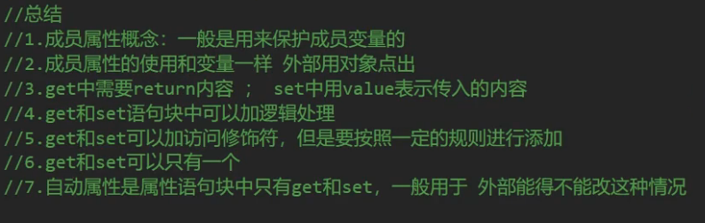

## 练习题

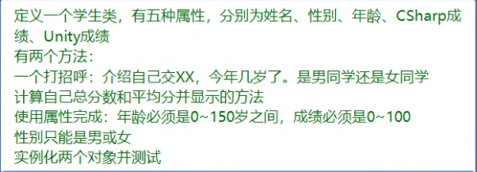

```c#
```

# 索引器

## 基本概念

让对象可以想数组一样通过索引访问其中元素，使程序看卡来更直观，更容易编写


## 索引器语法

```C#
访问修饰符 返回值 this[参数类型 参数名, 参数类型 参数名....]
{
	内部的写法和规则和属性相同
	get{}
	set{}
}
```

例子

```c#
class Person
{
    private string name;
    private int age;
    private Person[] friends;
   
    public Person this[int index]
    {
        get
        {	
            //可以写逻辑，根据需求来处理内容
            if( friends == null || friends.Length - 1 < index)
            {
                return null;
            }
        	return friends[index];
        }
        set
        {
        	//value代表传入的值
            //同样可以写逻辑
            if( friends == null)
            {
                friends = new Person[] {value};
			}
        	friends[index] = value;
        }
    }
}
```


## 索引器的使用

```C#
Console.WriteLine("索引器");
Person  = new Person();
p[0] = new Person();
Console.WriteLine(P[0]);
//Main函数中
```


## 索引器的重载

重载的概念是一一函数名相同 参数类型、数量、顺序不同


总结： 索引器可以让我们以中括号的形式范围自定义类中的元素 规则自己定 访问时和数组一样

比较适用于在类中有数组变量时使用 可以方便的访问和进行逻辑处理


# 静态成员

## 基本概念

静态关键字 `static`

用`static` 修饰的**成员变量、方法、属性**等 称为 静态成员

静态成员的特点是：直接用类名点出使用

```C#
class Test
{
    //静态成员变量
    static public float PI = 3.1415926f;
    //成员变量
    public int testInt = 100;

    //静态成员方法
    public static float CalcCircle(float r)
    {
        //πr²
        return PI * r * r;
    }
    //成员方法

    public void TestFun()
    {
   	 	Console.WriteLine("123");
    }
}
```

## 静态成员的使用

```c#
class Program
{
    static void Main(string[] args)
    {
        Console.WriteLine("静态成员");
        Console.WriteLine(Test.PI);
        Console.WriteLine(Test.CalcCircle(2));
    }
}

```

静态成员与普通成员的区别就是静态的可以直接像`类名.变量（方法）`这样去使用，而普通成员就只能通过对象去调用

## 为什么可以直接点出来使用

我们要使用的对象，变量，函数都是要在内存中分配内存内存空间的。

之所以要实例化对象，目的就是分配内存空间，在程序中产生一个抽象的对象


**静态成员的特点**

- 程序开始运行时 就会分配空间，所以我们就可以直接使用
- 静态成员和程序共同生死
- 只要是使用了它，直到程序结束时内存空间才会被释放
- 所以一个静态成员就会有自己唯一的一个"内存小房间"
- 这让静态成员有了唯一性
- 在任何地方使用都是用的小房间里的内容，改变了它也是改变小房间力度内容。


## 静态成员对于我们的作用

 静态变量：

1. 常用唯一变量的申明
2. 方便别人获取的对象申明

静态方法：

常用的唯一方法申明 比如 相同规则的数学计算相关函数

但用多了的话，因为存放静态成员的内存一直不被释放，所以太多的话就容易导致频繁的GC导致卡顿


## 常量和静态变量

const(常量) 可以理解为特殊的static（静态）

**相同点**

他们都可以通过类名点出使用

**不同点**

1. const必须初始化 ，不能修改 static没有这个规则
2. const只能修饰变量、static可以修饰很多
3. const一定是写在访问修饰符后面的，static没有这个要求


# 静态类和静态构造函数

## 静态类

静态类也就是用`static`修饰的类，它只能包含静态成员且不能被实例化。

它能将常用的静态成员写在静态类中，方便使用。

静态类不能被实例化，更能体现工具类的唯一性。

比如**Console**就是一个静态类


 ## 静态构造函数

在构造函数加上`static`修饰

静态类和普通类中都可以有静态构造函数，它无法使用访问修饰符，不能有参数，且**只会自动调用一次**。

**第一次使用类的时候自动调用静态构造函数，且只调用一次。**


# 拓展方法

意思就是为现有 **非静态的变量类型** 添加新方法

作用：

1. 提升程序拓展性
2. 不需要在对象中重新写方法
3. 不需要继承来添加方法
4. 为别人封装的类型写额外的方法

特点：

1. 一定是写在静态类中
2. 一定是个静态函数
3. 第一个参数为扩展目标
4. 第一个参数用`this`修饰


语法：
```C#
// 访问修饰符 static 返回值 函数名(this 拓展类名 参数名,参数类型 参数值,.....)
static class Tools
{
	//为int拓展了一个成员方法
    //成员方法 是需要 实例化对象后 才 能使用的
    //value代表使用该方法的 实例化对象
	public static void SpeakValue(this int value) //value就是调用这个拓展方法的对象
    {
		//拓展方法的逻辑
        Console.WriteLine("为int拓展的方法" + value);
    }

}
// Main 方法中 ： int i = 10; i.SpeakValue();
//输出: 为int拓展的方法10

```

如果拓展的方法名与原类中已有的方法名重合，那么就只会调用原有的方法，不会调用拓展的方法


# 运算符重载

**运算符重载能够让我们的自定义类和结构体使用运算符**。

运算符关键字：`operator`

特点：

1. 一定是一个公共的静态方法
2. 返回值写在operator前
3. 逻辑处理自定义

让自定义类和结构体对象可以进行运算

注意

1. 条件运算符需要成对实现
2. 一个符号可以多个重载
3. 不能使用ref和out

## 基本语法

```
public static 返回类型 operator 运算符(参数列表)
```

```c#
class Point
{
	public int x;
	public int y;
	
	public static Point operator +(Point p1, Point p2)
	{
		return p = new Point();
		p.x = p1.x + p2.x;
		p.y = p1.y + p2.y;
		return p;
	}
    
    public static Point operator +(Point p1, int value)
	{
		return p = new Point();
		p.x = p1.x + value;
		p.y = p1.y + value;
		return p;
	}
}

class Progrom
{
	static void Main(string[] args)
    {
		Console.WriteLine("运算符重载");
        //使用
        Point p = new Point();
        p.x = 1;
        p.y = 1;
       	Point p2 = new Point();
        p2.x = 2;
        p2.y = 2;
        
        Point p3 = p + p2;
        
        Point p4 = p3 + 2; //顺序得按参数的顺序来 
    }
}
```


# 内部类和分部类

## 内部类

内部类就是在一个类中再申明一个类

主要就是使用时**要用包裹者点出自己**

```c#
class Person
{
	public int age;
    public string name;
    public Body body;
	public class Body
	{
        Arm leftArm;
        Arm rigthArm;
		class Arm
		{
		
		}
	}
}

class Program
{
    static void Main(string[] args)
    {
        Person p = new Person();
        Person.Body body = new Person.Body(); //内部类得用public修饰符外面才能访问得到
	}
}
```


## 分部类

分部类能把一个类分成几部分申明

分部类关键字`partial`

它能够分部描述一个类，并增加程序的拓展性。

注意：**分部类可以写在多个脚本文件中，但它的访问修饰符要一致且类中不能有重复成员**

```c#
public partial class Student //访问修饰符在关键字前面
{
	public bool sex;
    public string name;
}

public partial class Student
{
    public int number;
    public void Speak(string str){...}
}
//上面两者是同一个类，只不过分开来写了，他们共用成员变量、方法。
```


## 分部方法

分部方法就是**将方法的申明和实现分离**

特点：

1. 不能加访问修饰符，默认私有
2. 只能在分部类中申明
3. 返回值只能是void
4. 可以有参数但不用 out关键字

同样的关键字为`partial`


# 继承

## 基本概念
一个类A继承一个类B
类A将会继承类B的所有成员
A类将拥有B类的所有特征和行为

**被继承的类**
称为父类、基类、超类

**继承的类**
称为子类、派生类
子类可以有自己的特征和行为

**特点**
1.单根性子类只能有一个父类
2.传递性子类可以间接继承父类的父类

比如

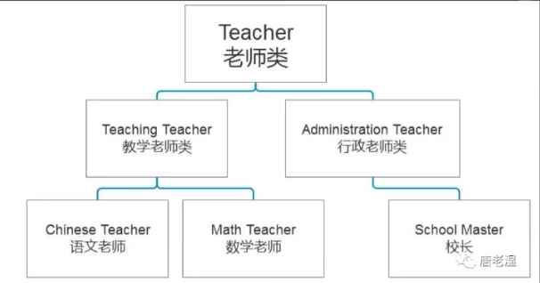

## 语法

```c#
class 类名: 被继承的类名
{
	
}
```


## 实例

教学老师类继承老师类

```c#
class Teacher
{
	//姓名
	public string name;
    //职工号
	public int number;
    
    //介绍名字
	publicyoid SpeakName()
    {
    	Console.WriteLine(name);
    }
}

class TeachingTeacher : Teacher
{
	//科目
    public string subject;
    
    //介绍科目
    public void SpeakSubject()
    {
    	Console.WriteLine(subject + "老师");
    }
}
```


## 访问修饰符的影响

public - 公共 内外部访问
private - 私有内部访问
protected - 保护 内部和子类访问
之后讲命名空间的时候讲
internal- 内部的 只有在同一个程序集的文件中，内部类型或者是成员才可以访问


## 里氏替换原则


### 基本概念

里氏替换原则还面向对象七大原则中最重要的原则。

**任何父类出现的地方，子类都可以替代**。

语法表现——父类容器装子类对象，因为子类对象包含了父类的所有内容

作用：方便进行对象存储和管理


### 基本实现

```c#
class GameObject
{
 ...
}

class Player : GameObject
{
	public void PlayerAtk()
	{
		Console.WriteLine("玩家攻击");
	}
}

class Monster : GameObject
{
	public void MonsterAtk()
	{
		Console.WriteLine("怪物攻击");
	}
}

class Boss : GameObject
{
	public void BossAtk()
	{
		Console.WriteLine("Boss攻击");
	}
}

class Program
{
    static void Main(string[] args)
    {
    Console.WriteLine("里氏替换原则");
    //里氏替换原则 用父类容器 装载子类对象
        
    GameObject player = new Player();
    GameObiect monster = new Monster();
    GameObject boss = new Boss();
        
    GameObject[] objects = new GameObject[] {new Player(), new Monster(), new Boss()};
    }
}
```

### is和as

**is** ：用来判断一个对象 是否是指定类对象，返回值为 bool类型

```c#
if(player is Player)
{
	...//为真则执行逻辑
}
else if(player is Monster)
{
    ...
}
```


**as**：将一个对象转换为指定类对象，返回值——指定类型对象，成功返回执行类型对象，失败返回null。

```
Player p = monster as Player; //成功转换的话p就为Player对象，失败p就为null。
```

`类对象 is 类名` 该语句块    会有一个bool返回值true和false

`类对象 as 类名` 该语句块    会有一个对象返回值对象和nu11

## 继承中的构造函数

### 基本概念 

特点：

当申明一个子类对象时，先执行父类的构造函数，再执行子类的构造函数

注意：

父类的无参构造很重要，子类可以通过**base**关键字 **代表父类调用父类构造**


### 继承中构造函数的执行顺序

父类的父类的构造——>...父类构造 ——>。。。——>子类构造


### 父类的无参构造很重要

//子类实例化时 默认自动调用的是父类的无参构造 所以如果 父类无参构造  被有参构造顶掉 会报错

用base来调用父类的有参构造就能解决报错，或者将无参构造写上即可。

```c#
//用base的情况
class Father
{
	public Father(int i)
    {
		Console.WriteLine("Father构造");
    }
}
--------------------------------
class Son : Father 
{
	//会报错
    public Son(int i) //默认调用父类无参构造，但是父类中没有无参构造，所以报错
    {
        ...
	}
}
--------------------------------
class Son : Father 
{ 
	public Son(int i) : base(i) //相当于调用父类的有参构造，不报错
    {
		...
    }
    
    public Son(int i,string str) //默认调用父类无参构造函数，而父类没有申明，报错
    {
        ...
    }
    
    public Son(int i,string str) : this(i)  //调用自己的有参构造，没有问题。
    {
        ...
    }
}
```


## 万物之父和装填拆箱

万物之父， 关键字:`object`

概念：

object是所有类型的基类，它是一个类(引用类型)

作用：

可以利用**里氏替换原则**，用object容器装所有对象

可以用来表示不是确定类型，作为函数参数类型。


### 使用

引用类型用 `is` `as` 来判断和转换

```c#
object o = new Son();

if( o is Son)
{
	(o as Son).Speak();
}
```


值类型用强转

```C#
objcet o2 = 1f;
float f1 = (float)o2;
```


特殊的string类型

```c#
object str = "123123"
string str2 = str as string;
```


### 装箱拆箱

**发生条件** 

用object存值类型(装箱)

再把object转为值类型(拆箱)


**装箱**

把值类型用引用类型存储

栈内存会迁移到堆内存中


**拆箱**

把引用类型存储的值取出来

堆内存会迁移到栈内存中


好处：不确定类型时可以方便参数的存储和传递

坏处：存在内存迁移，增加性能消耗


```
//装箱
object v = 3;
//拆箱
int intValue = (int)v;
```


## 密封类

### 基本概念

是使用 `sealed` 密封关键字修饰的类，可以让类无法再杯继承

### 实例

```
class Father
{

}

sealed class Son:Father //这是最后一个类，无法再进行继承
{
	
}

class T:Son //报错，无法继承
{

}
```

主要用来保证程序的规范性和安全性


# 多态

## vob
### 基本概念

**v: virtual(虚函数)**

**o: override(重写)**

**b: base(父类)**


多态按字面的意思就是“多种状态”
让继承同一父类的子类们 在执行相同方法时有不同的表现(状态)

主要目的
同一父类的对象执行相同行为（方法）有不同的表现

解决的问题
让同一个对象有唯一行为的特征

### 多态的实现

```c#
class Gameobject
{
	public string name;
    public GameObject(string name)
    {
    	this.name = name;
    }
   //虚函数可以被子类重写
    public virtual void Atk()
    {
    	Console.WriteLine("游戏对象进行攻击");
    }
}
class Player:GameObject
{
	public Player(string name):base(name)
    {
        
    }
    
    public override void Atk()
    {
        //base的作用
        //代表父类 可以通过base来保留父类的行为
		//base.Atk();
        Console.WriteLine("玩家对象进行攻击");
    }
}

class Program
{
    static void Main(string[] args)
    {
    	Console.WriteLine("多态vob");
    	GameObject p = new Player("唐老师");
        p.Atk(); //输出： 玩家对象进行攻击
    }
}
```

当我们希望同一种操作在不同对象上表现出不同的行为时，就可以将父类的方法使用 **virtual** 修饰，使它成为虚方法。这样子类就可以使用 **override** 对该方法进行重写。当父类类型引用指向子类对象时，调用这个方法会根据对象的**实际类型**，执行对应子类中重写后的方法，而不是执行父类中的实现。这就是 C# 多态的体现。


## 抽象类和抽象方法

### 概念

被抽象关键字`abstract`修饰的类

特点：

1. 不能被实例化的类
2. 可以包含抽象方法
3. 继承抽象类必须重写其抽象方法 


```c#
abstract class Thing
{
	//抽象类中封装的所有知识点都可以在其中书写
	public string name;
	
	//可以在抽象类中写抽象函数
}

class Water : Thing
{
	
}

class Program
{
    static void Main(string[] args)
    {
        Console.WriteLine("抽象类和抽象方法");
        //抽象不能被实例化
        //Thing t = new Thing(); //这样会报错，抽象类不能被实例化
        //但是 可以遵循里氏替换原则 用父类容器装子类
        Thing t.= new Water();
	}
}
```


### 抽象函数

又叫**纯虚方法**

就是用 `abstract` 关键字修饰的方法

特点：

1. 只能在抽象类中申明
2. 没有方法体
3. 不能是私有的
4. 继承后必须实现 用override重写

```c#
abstract clas Fruits
{
	public string name;
	
	//抽象方法一定不能有函数体
	public abstract void Bad();//完全不能写逻辑
    
    public virtual void Test()
    {
		//可以选择是否写逻辑
    }
}

class Apple : Fruits
{
	public override void Bad()
    {

    }
    //虚方法可以由子类选择性的来实现
    //抽象方法必须要实现 
}
```


## 接口

### 接口的概念

接口是行为的抽象规范，它也是一种自定义类型

关键字：`interface`


接口申明的规范
1.不包含成员变量
2.只包含方法、属性、索引器、事件
3.成员不能被实现
4.成员可以不用写访问修饰符，不能是私有的
5.接口不能继承类，但是可以继承另一个接口

接口的使用规范
1.类可以继承多个接口
2.类继承接口后，必须实现接口中所有成员

特点：
1.它和类的申明类似
2.接口是用来继承的
3.接口不能被实例化，但是可以作为容器存储对象

### 接口的申明

接口关键字：interface
语法：

```
interface 接口名
{

}
```


一句话记忆：接口是抽象行为的“基类”
接口命名规范 帕斯卡前面加个I


```c#
interface IFly
{
	public void Fly(); //不写访问修饰符默认为public
    
    string Name
    {
        get;
        set;
    }
    
    int this[int index]
    {
		get;
        set;
    }
    
    event Action doSomething;
}
```


### 接口的使用

接口用来继承
1.类可以继承1个类，n个接口

2.继承了接口后必须实现其中的内容并且必须是public的

3.实现的接口函数，可以加v再在子类重写

4.接口也遵循里氏替换原则

```c#
interface IFly
{
	public void Fly(); //不写访问修饰符默认为public
    
    string Name
    {
        get;
        set;
    }
    
    int this[int index]
    {
		get;
        set;
    }
    
    event Action doSomething;
}

class Animal
{
    ...
}

class Person : Animal, IFly
{
    //继承了接口就要实现接口里面所有的东西
	public virtual void Fly() //实现接口的函数，可以加v在子类中重写
    {
		
    }
    
    public string Name
    {
		get;
        set;
    }
    
    public int this[int index]
    {
		get
        {
			return 0;
        }
        set    
        {

        }
    }
    
    public event Action doSomething;
}

```


### 接口可以继承接口

接口继承接口时 **不需要实现**

待类继承接口后 **类自己去实现所有内容**

```
interface IWalk
{
	void Walk();
}

interface IMove : IFly,IWalk
{

}

class Test : IMove
{
	//实现所有接口里的内容。。。
	//此时它是所有继承接口的子类
}
```


### 显示实现接口

当一个类继承两个接口

但是接口中存在着同名方法时

注意：**显示实现接口时 不能写访问修饰符**

```C#
interface IAtk
{
	void Atk();
}

interface ISuperAtk
{
	void Atk();
}

class Playr : IAtk, ISuperAtk
{
	//显示实现接口 就是用 接口名.行为名 去实现
	void IAtk.Atk()
    {
		...
    }
    
    void ISuperAtk.Atk()
    {
		...
	}
}

//使用
Player p = new Player();
(p as IAtk).Atk();
(p as ISuperAtk).Atk();
-------------------------
IAtk ia = new Player();
ISuperAtk isa = new Player();
ia.Atk();
isa.Atk();
```


总结：
继承类：是对象间的继承，包括特征行为等等
继承接口：是行为间的继承，继承接口的行为规范，按照规范去实现内容
由于接口也是遵循里氏替换原则，所以可以用接口容器装对象
那么久可以实现装载各种毫无关系但是却有相同行为的对象


注意:

1.接口值包含成员方法、属性、索引器、事件，并且都不实现，都没有访问修饰符

2.可以继承多个接口，但是只能继承一个类
3.接口可以继承接口，相当于在进行行为合并，待子类继承时再去实现具体的行为

4.接口可以被显示实现主要用于实现不同接口中的同名函数的不同表现

5.实现的接口方法 可以加 virtua1关键字 之后子类再重写

## 密封方法

用密封关键字`sealed` 修饰的重写函数

作用： 让虚方法或者抽象方法之后不能再被重写

特点：和override一起出现


```C#
abstract class Animal
{
    public string name;

    public abstract void Eat();

    public virtual void Speak()
    {
    	Console.WriteLine("叫");
    }
}

class Person:Animal
{
    public override void Eat()
    {

    }
    public override void Speak()
    {
        
    }
}

class WhitePerson:Person
{
    public override void Eat()
    {
        base.Eat();
    }

	public override void Speak()
	{
    	base.Speak();
	}
}

```


# string

```c#
//字符串本质是char数组
string str = "苏同学";
Console.WriteLine(str[0]);
//打印结果为"苏"

//⭕转为char数组
char[] chars = str.ToCharArray();

//⭕获取字符长度
str.Length

//⭕字符串拼接
str = string.Format("{0}{1}",1,222);

//⭕正向查找字符位置 
str = "我是苏同学？";
int index = str.IndexOf("苏");
//返回 2 字符串的索引 , 找不到就会返回-1

//⭕反向查找字符位置
str = "我是苏同学苏同学？";
index = str.LastIndexOf("苏同学");
//返回 5 从后面开始查找词组就返回第一个字的索引，找不到就返回-1

//⭕移除指定位置后的字符
str = "我是苏同学苏同学";
str = str.Remove(4);
//返回 "我是苏同"

//⭕执行两个参数进行移除 参数1开始的位置 参数2字符个数
str = "我是苏同学陈同学";
str = str.Remove(3,3);
//返回"我是陈同学" 

//⭕替换指定字符串
str = "我是苏同学陈同学";
str = str.Replace("苏同学","李同学");
//返回"我是李同学陈同学" 

//⭕大小写转换
str = "abcdefg";
str = str.ToUpper();
//返回"ABCDEFG"
str = str.ToLower();
//返回"abcdefg"

//⭕字符串截取 截取从指定位置开始之后的字符串
str = "苏同学陈同学";
str = str.Substring(3);
//返回 "陈同学"
//重载 参数1开始位置 参数2指定个数
str = "苏同学陈同学苏同学";
str = str.Substring(3,3);
//返回 "陈同学"

//⭕⭕⭕字符串切割 指定切割符号来切割字符串
str = "1|2|3|4|5|6|7|8";
string[] strs = str.Split("|");
//返回 string[]{1,2,3,4,5,6,7,8}

https://www.yuque.com/gnocoaixus/kb/vu71nd?#EzuZ4
```

# StringBuilder

string 是特殊的引用

每次重新赋值或者拼接时会分配新的内存空间

如果一个字符串经常改变会非常浪费空间


**StringBuilder** 是C#提供的一个用于处理字符串的公共类

主要解决的问题是：

修改字符串而不创建新的对象，需要频繁修改和拼接的字符串可以使用它，可以提升性能

使用前，需要引用命名空间


## 初始化 直接指明内容

在代码最前面引用命名空间

```c#
using System.Text;
```

接着来实例化

```C#
StringBuilder str = new StringBuilder("123123123",这里可以定义最大容量);
Console.WriteLine(str);
//输出 123123123
```


## 容量

**StringBuilder存在一个容量的问题，每次往里面增加时会自动扩容**

**StringBuilder其实是一个可以自动变大的字符串仓库**


`StringBuilder` 的工作原理可以概括为：

1. **内部维护一个 `char[]` 缓冲区**，用于存储字符。
2. **`Append()` 时先检查容量是否足够**，足够就直接把字符写入数组末尾，并更新 `Length`。
3. **容量不足时自动扩容**：申请更大的 `char[]`、复制旧数据、替换引用，旧数组等待垃圾回收，一般为上次容量大小的两倍。
4. **整个追加过程中不会不断创建新的字符串对象**，只有调用 **`ToString()`** 时，才会根据当前缓冲区内容创建并返回一个新的 `string`。

正因为避免了频繁创建和复制字符串对象，`StringBuilder` 在大量字符串拼接时通常比直接使用 `string` 拼接具有更好的性能。


**获取容量**

```C#
Console.WriteLine(str.Capacity);
```

**获取字符长度**

```C#
Console.WriteLine(str.Length);
```

## 增删查改替换

```
//增
str.Append("123"); //在字符串后加入123

str.AppendFormat("{0}{1}", 100, 999) //在末尾加入100,999字符串

//插入
str.Insert(0,"123"); //在下标0的位置插入字符串123

//删
str.Remove(0,10);删除0-10位置的字符串

//清空
str.Clear();

//查
Console.WriteLine(str[1]);

//改
str[0] = 'A'; //将下标0的字符串改为A

//替换
str.Replace("1","t"); //将字符串内的1与t进行替换


```

# 结构体和类的区别


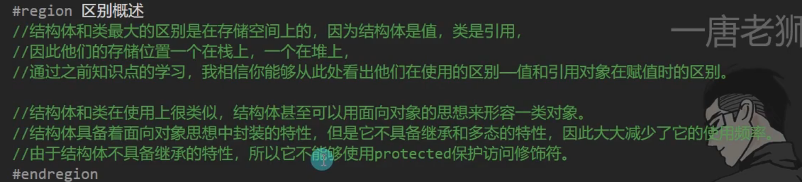


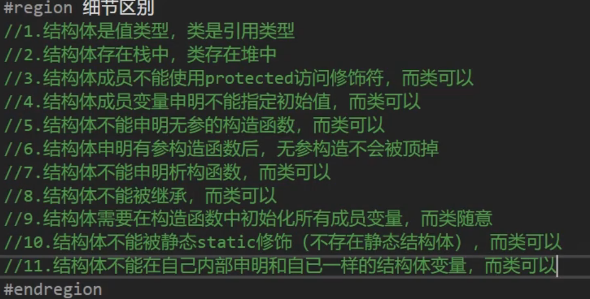

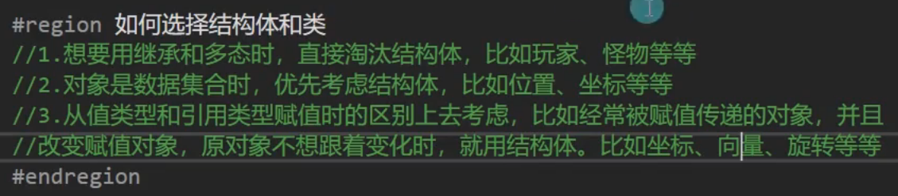


**结构体可以继承 接口 因为接口是行为的抽象**

# 抽象类和接口的区别

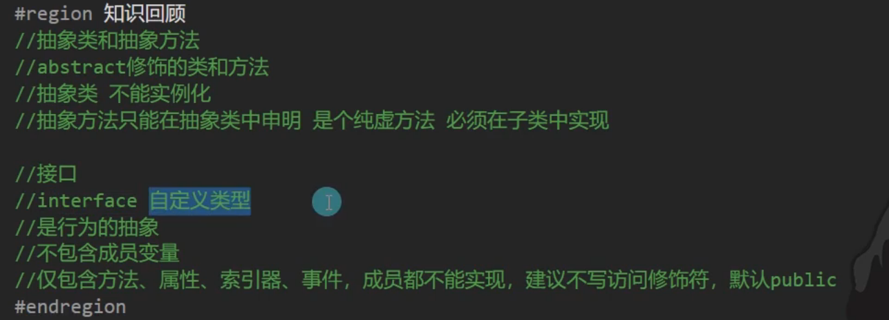

## 相同点

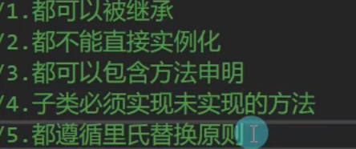


## 区别

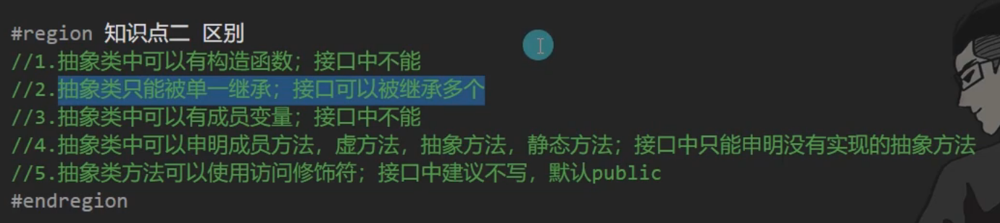


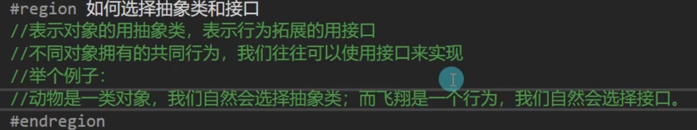
